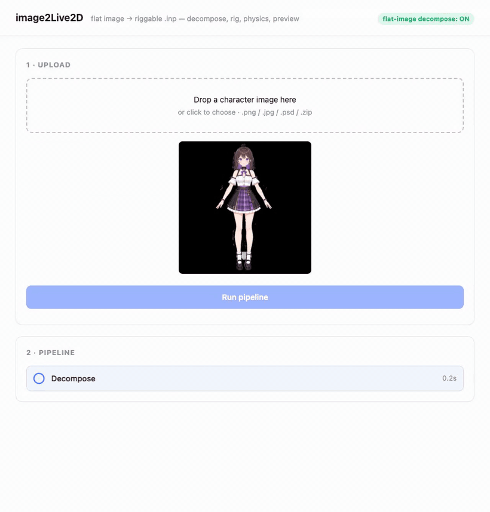
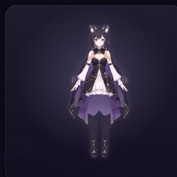
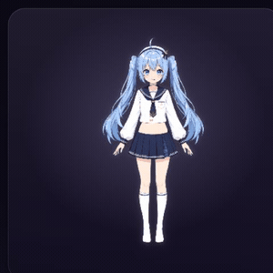
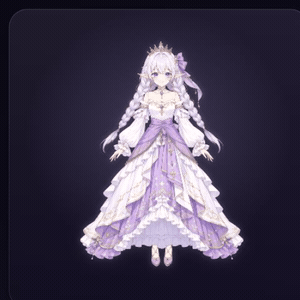
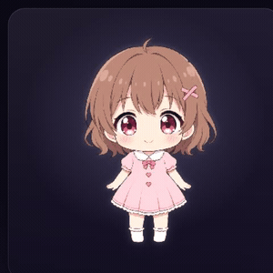
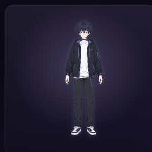
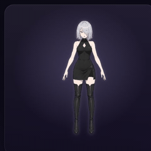
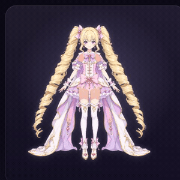
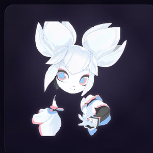
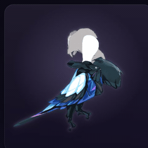

<p align="center"></p>

<h1 align="center">image2live2d</h1>

<p align="center">
  <b>Turn a single character illustration into a reusable, riggable 2D puppet</b><br>
  that blinks, lip-syncs, follows the cursor, turns its head, and self-animates its hair &amp; cloth —<br>
  live in the browser, at near-zero per-frame cost. You get a <i>rig</i>, not a baked video.
</p>

<p align="center">
  <a href="LICENSE"></a>
  
  <a href="https://github.com/Wzhang3912/image2live2d/actions/workflows/ci.yml"></a>
  
</p>

<p align="center">
  <a href="#quick-start">Quick start</a> ·
  <a href="#what-you-get">Output formats</a> ·
  <a href="#what-the-puppet-does">Capabilities</a> ·
  <a href="#how-it-works">How it works</a> ·
  <a href="#credits">Credits</a>
</p>

<p align="center">
  <a href="media/demo.mp4"></a>
</p>

<p align="center"><i>One illustration → auto-decompose → auto-rig → live puppet — then the same pipeline across nine wildly different styles. &nbsp;<a href="media/demo.mp4">▶ Full-quality MP4</a></i></p>

---

## Why

Rigging a Live2D-style puppet by hand is hours of skilled work in a GUI editor — meshing every part,
authoring deformers for blink/mouth/head-turn, wiring physics for hair and cloth. **image2live2d does
that headlessly, from art.** Point it at separated character layers and it builds a complete rig and
emits it to standard, open animation formats — no Cubism Editor, no manual meshing, no per-frame
rendering.

It's not portrait-only and it's not baked video: it's a **full-body, interactive rig** you can drive
with lip-sync, motion capture, or a cursor.

## Quick start

```bash
pip install -e ".[decompose]"            # Pillow + psd-tools (PSD / layer input)

# a folder of {order}_{role}.png layers → animatable nijilive .inp
python -m image2live2d path/to/layers -o character.inp

# a layered PSD (e.g. a See-through decompose)
python -m image2live2d --psd hero.psd -o hero.inp

# emit a Live2D bundle and an editable Cubism project alongside the .inp
python -m image2live2d --psd hero.psd -o hero.inp --live2d hero_live2d/ --cmo3 hero.cmo3

# no art handy? generate a built-in sample (face or full-body)
python -m image2live2d --sample --fullbody -o sample.inp

# batch a whole roster with a pass-rate report
python -m image2live2d --batch path/to/roster -o out/

# local web app: drag-drop a PSD / zip of layers, preview and download
python -m image2live2d --serve            # http://127.0.0.1:8000
```

```python
from image2live2d import convert_psd

result = convert_psd("hero.psd", "out/", live2d=True)   # nijilive .inp + Live2D bundle
print(result.inp_path, result.passed)
```

<!-- Media slot: a short screen-capture of `--serve` (drag-drop → preview) would sit well here.
     Drop it at media/webapp.gif (or .mov) and uncomment:
<p align="center"></p> -->

## What you get

One rig, three standard targets — build it once, emit to whichever ecosystem you're in:

| Format | File(s) | Ecosystem | Status |
| --- | --- | --- | --- |
| **nijilive** | `.inp` | Opens directly in [nijigenerate](https://github.com/nijigenerate/nijigenerate) — open format, fully headless | ✅ **Mature** — the primary, fully-validated target |
| **Live2D Cubism** | `.moc3` + `.model3.json` / `.physics3.json` / `.motion3.json` / `.cdi3.json` | Cubism Viewer, VTube Studio, standard Live2D runtimes | ✅ Codec **byte-for-byte validated** against 5 official models; renders with head-turn + hair physics. `.moc3` authoring is opt-in (see [Notes](#notes-on-the-live2d-targets)) |
| **Cubism Editor** | `.cmo3` | Editable Cubism **project** — open, tweak, and re-export in Cubism Editor 5 | 🧪 Experimental — deformers + physics graph build; Editor-validation ongoing |

Most tools that touch this space either target portraits only or export a *display* model you can't
edit. image2live2d emits an **editable project** (`.cmo3`) too — so the rig is a starting point a human
artist can refine, not a dead end.

## What the puppet does

Every rig is driven by standard Live2D parameter IDs, so the same motions, ARKit tracking, and lip-sync
drive all backends. Out of the box a generated rig animates:

| | |
| --- | --- |
| 👁️ **Eyes** | per-eye blink (real closed-eye art-swap, not a squash), gaze / eyeball tracking |
| 👄 **Mouth** | open/close with a synthesized interior cavity, mouth form (a–i–u–e–o lip-sync) |
| 🙂 **Face** | per-character head turn (X/Y/Z on a depth dome), brow raise, expression presets |
| 🧍 **Body** | body sway, breathing, arm & leg articulation about silhouette joints |
| 💨 **Physics** | per-strand hair sway + skirt/cloth pendulums that self-animate from head & body motion |
| ♻️ **Idle** | a looping idle (blink + breath + sway) so the model is alive the moment it loads |

The pipeline also self-diagnoses: a per-character **capability report** tells you honestly what a given
puppet can and can't do, and QA flags implausible geometry (e.g. an off-centre mouth on a ¾ view).

### …on any character, any style

Nine characters, one pipeline — each auto-rigged and idling (blink · head-turn · hair/cloth physics),
straight from a single illustration. Gothic and schoolgirl anime, ornate gowns, a chibi, a male
character, and non-human mascots (a Krita squirrel, a Kate bird):

<table align="center">
  <tr>
    <td></td>
    <td></td>
    <td></td>
  </tr>
  <tr>
    <td></td>
    <td></td>
    <td></td>
  </tr>
  <tr>
    <td></td>
    <td></td>
    <td></td>
  </tr>
</table>

## Input

The converter takes **already-separated layers** — a layered PSD, or a folder/zip of
`{order}_{role}.png` files (e.g. `00_hair_back.png`, `13_face_base.png`). Layer names drive role
detection (face, eyes, hair, limbs, clothing, …), meshing, and rig authoring.

To start from a **single flat image**, the pipeline calls a [See-through](#credits) decompose service
(GPU) that splits the illustration into ordered layers first — this is what the demo above shows. Pass
`--image photo.png --decompose-url <service>` (or `--gcp-instance` to auto-start a VM). See
[`service/seethrough/`](service/seethrough) and [`docs/DECOMPOSE_SERVICE.md`](docs/DECOMPOSE_SERVICE.md).

The rig authoring **generalizes beyond anime** — it's been stress-tested on stylized, non-human mascots
(dragons, birds, faceted/cubist art) and degrades gracefully rather than producing wrong output.

## How it works

The pipeline builds a format-agnostic **Intermediate Rig Representation (IRR)** from the art, then emits
it. Everything up to the IRR is shared; only the final emitter is backend-specific.

```
ingest → preprocess → decompose → mesh → rig authoring → physics → motion → IRR
                                                                              ├── nijilive emitter → .inp
                                                                              ├── live2d emitter   → .moc3 bundle
                                                                              └── cmo3 emitter     → .cmo3 project
```

## Layout

```
src/image2live2d/
  irr/        # rig representation — the schema everything is built around
  core/       # pipeline stages: decompose, mesh, landmark, rig, physics, motion, qa
  backends/   # emitters: nijilive (.inp) and Live2D (.moc3 bundle + .cmo3 project)
  api.py      # public API: convert_layers / convert_psd
  batch.py    # batch conversion + aggregate QA
  app/        # local web app
service/
  seethrough/ # GPU decompose service (single-image → layers)
tests/
```

## Notes on the Live2D targets

- The `.moc3` codec is **fully reverse-engineered and generated from scratch** — no Cubism template
  required — and is validated **byte-for-byte** against five official v3 models (round-trip + rebuild).
  It renders a full character in Cubism Viewer 5.3 / VTube Studio with head-turn and hair physics.
- The CLI's `--live2d` writes the **open JSON siblings** (`model3`/`physics3`/`motion3`/`cdi3`) by
  default; these are MOC-independent and already drive any Live2D model. Authoring the closed `.moc3`
  binary is an explicit opt-in — the remaining gate is *legal* (Live2D's SDK license), not technical.
- `.cmo3` (editable Cubism **project**) is the newest target: the deformer + physics graph builds today;
  round-tripping through the proprietary Cubism Editor is still being hardened. See
  [`docs/CMO3_EDITOR_VALIDATION.md`](docs/CMO3_EDITOR_VALIDATION.md).

Contributions and issues welcome.

## Credits

Single-image layer decomposition is powered by **See-through**, the automatic anime-character layer
decomposer that turns one flat illustration into ordered layers — which this project then meshes, rigs,
and animates.

> Jian Lin, Chengze Li, Haoyun Qin, Kwun Wang Chan, Yanghua Jin, Hanyuan Liu, Stephen Chun Wang Choy,
> Xueting Liu. **_See-through: Single-image Layer Decomposition for Anime Characters._** SIGGRAPH 2026.
> [arXiv:2602.03749](https://arxiv.org/abs/2602.03749) ·
> [code](https://github.com/shitagaki-lab/see-through) (Apache-2.0)

This project also builds on [nijilive / nijigenerate](https://github.com/nijigenerate/nijigenerate)
(the open 2D-puppet format and editor) and the [Live2D Cubism](https://www.live2d.com/) `.moc3` format.
See-through and nijilive are independent projects and are not affiliated with this repository.

## Development

```bash
pip install -e ".[dev]"
python -m pytest -q
```

## License

Apache-2.0 — see [LICENSE](LICENSE). Third-party components (See-through, nijilive, Live2D Cubism) are
governed by their own licenses.
